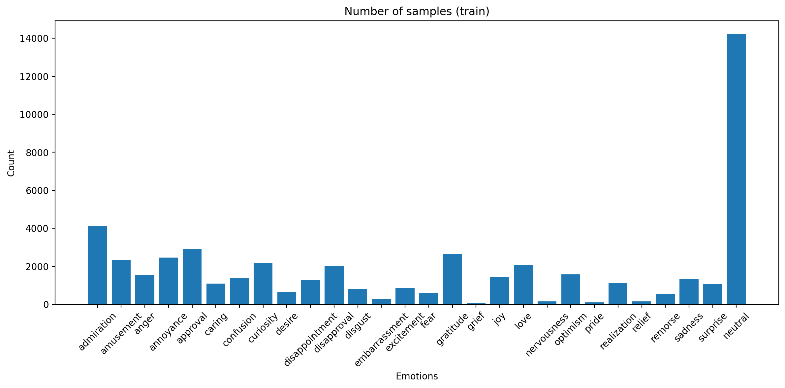
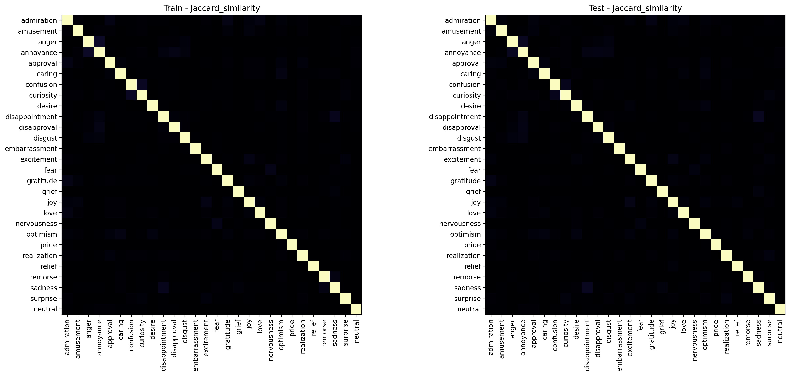
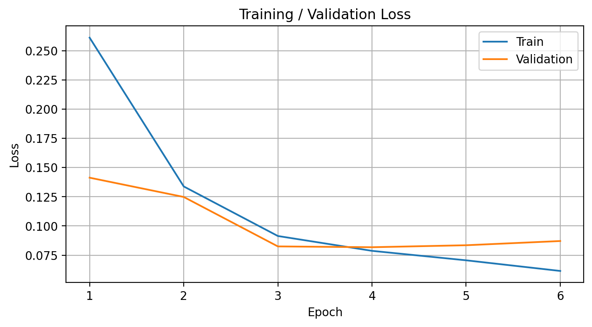

# Emotion Classification Experiments

> **AI assistance:** I used GitHub Copilot to organize and draft this report from the project's code, configurations, logs, metrics, and plots. The implementation and experiments are my work; the report wording and synthesis are AI-assisted. I am responsible for reviewing the claims before publication.

This project compares neural approaches for multi-label emotion classification on GoEmotions. The report summarizes the saved test results; per-run configurations and detailed metrics remain in `outputs/`.

## Data and evaluation

[GoEmotions](https://aclanthology.org/2020.acl-main.372/) contains English Reddit comments labeled with 27 emotions plus `neutral`. A comment may have multiple labels. This project loads the `simplified` dataset configuration and uses its train, validation, and test splits. The dataset is downloaded at runtime rather than stored in this repository.

Text is tokenized with `bert-base-uncased` and truncated to 128 tokens. The BiLSTM variants use a trainable embedding; Transformer variants use `distilbert-base-uncased`, either frozen as a feature extractor or fine-tuned. The saved runs use batch size 32 and seed 418. Checkpoints were selected by validation micro-F1; per-class decision thresholds were tuned on validation and then used for test evaluation. Micro-F1 summarizes decisions across labels, while macro-F1 weights labels equally. Both scores are useful here because the dataset is imbalanced.

These runs are exploratory, not a controlled architecture-only comparison: learning rates, dropout, training thresholds, and model-head designs changed between runs. The exact historical source revision for each run is not saved.

## Test results

All values below come from the saved test result for each run. Precision and recall are micro-averaged; lower Hamming loss is better. Select a run date to view its full per-class metrics and prediction statistics.

| Model | Run and detailed results | Micro-F1 | Macro-F1 | Precision | Recall | Hamming loss |
|---|---|---:|---:|---:|---:|---:|
| BiLSTM, last-token | [2025-11-29](outputs/bilstm-last-token/2025-11-29_13-08/eval/test_results.json) | 48.98% | 39.01% | 42.85% | 57.17% | 0.0496 |
| BiLSTM, max-pool | [2025-11-28](outputs/bilstm-max-pool/2025-11-28_23-30/eval/test_results.json) | 54.76% | 44.01% | 49.23% | 61.70% | 0.0425 |
| Transformer, feature extraction | [2025-11-29](outputs/transformer-feature-extract/2025-11-29_15-22/eval/test_results.json) | 47.51% | 33.63% | 41.64% | 55.29% | 0.0509 |
| Transformer, feature extraction | [2025-12-23](outputs/transformer-feature-extract/2025-12-23_15-50/eval/test_results.json) | 49.37% | 38.51% | 43.38% | 57.28% | 0.0489 |
| Transformer, feature extraction | [2026-01-04](outputs/transformer-feature-extract/2026-01-04_22-06/eval/test_results.json) | 47.83% | 35.07% | 43.03% | 53.83% | 0.0489 |
| Transformer, fine-tuning | [2025-11-29](outputs/transformer-fine-tune/2025-11-29_16-26/eval/test_results.json) | 58.66% | **51.38%** | 53.12% | **65.49%** | 0.0384 |
| Transformer, fine-tuning | [2025-12-23](outputs/transformer-fine-tune/2025-12-23_18-12/eval/test_results.json) | 58.34% | 50.64% | 53.41% | 64.28% | 0.0382 |
| Transformer, fine-tuning | [2026-01-03](outputs/transformer-fine-tune/2026-01-03_20-47/eval/test_results.json) | **59.87%** | 50.40% | **55.30%** | 65.26% | **0.0364** |

Fine-tuning gave the strongest overall results in these runs. The January run had the highest micro-F1 and lowest Hamming loss; the November run had the highest macro-F1 and recall. Max-pooling was the stronger of the two BiLSTM variants. Since configurations changed between runs, these results do not establish that architecture alone caused the differences.

## Experiment progression

- **BiLSTM:** The last-token model was the first baseline and took longer to train than expected. Replacing last-token selection with masked max-pooling was an unexpected improvement: the README's original comparison records both better scores and shorter training time for max-pooling. The saved logs show 15 epochs for last-token and early stopping after 11 epochs for max-pooling.
- **Transformer feature extraction:** The first run used a 0.6 threshold for validation metrics, stopped after seven logged epochs, and saved its best checkpoint at epoch four. The experiment notes attributed the early stopping in part to the threshold. Lowering it to 0.3 in the December run improved the recorded test metrics, making that the strongest feature-extraction run. A January run with lower dropout did not improve on it.
- **Transformer fine-tuning:** The first two runs used a two-layer head and were described in the notes as unstable and prone to overfitting; lowering the validation threshold helped the feature-extraction run but did not prevent early stopping here. The January attempt added warm-up and a scheduler, reduced the head to one layer, lowered dropout from 0.3 to 0.1, and lowered the encoder learning rate. It achieved the best micro-F1, but its training log still shows validation loss rising after its minimum, so overfitting remained a concern.

The README's earlier summary recorded training durations of 1:26 for last-token BiLSTM, 0:46 for max-pooling, 1:15 for feature extraction, and 0:32 for fine-tuning. The timing format, hardware, and measurement procedure were not documented, so treat these as historical rough comparisons rather than reproducible benchmarks.

## Limitations and future work

These results are a useful baseline, not a final or broadly validated classifier. Only one seed is represented, runs changed multiple settings at once, and no trained checkpoint is included. Performance may also differ on data outside English Reddit comments.

Useful next steps are to repeat the leading configurations with multiple seeds, compare model variants while keeping other settings fixed, and investigate regularization and learning-rate choices for the fine-tuned Transformer. The current training setup also hardcodes its loss and optimizer; making these configurable and adding automated tests would improve extensibility and reliability. Other architectures can then be compared against the same baseline and evaluation protocol.

## Artifacts

Per-class metrics, confusion statistics, configurations, training logs, thresholds, and additional plots are kept with each run under `outputs/`. For example, the [January fine-tuning configuration](outputs/transformer-fine-tune/2026-01-03_20-47/config.yaml), [training log](outputs/transformer-fine-tune/2026-01-03_20-47/train.log), and [confusion statistics](outputs/transformer-fine-tune/2026-01-03_20-47/eval/confusion_stats.json) are available alongside its test metrics.
